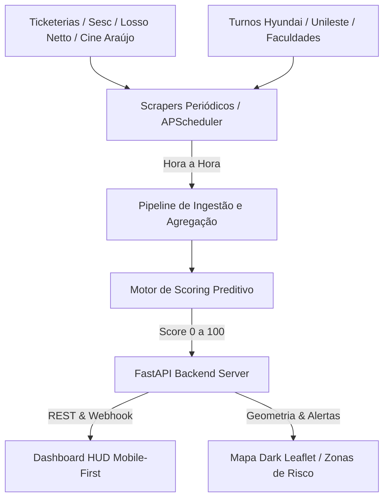

# 🚖 PIRA-TACTICAL: Dashboard em Tempo Real para Motoristas de App (Piracicaba-SP)

Sistema de inteligência tática, web scraping automatizado e ranking preditivo de rentabilidade desenhado especificamente para as particularidades urbanas e econômicas de **Piracicaba - SP**.

---

## 🏛️ 1. Arquitetura do Sistema



### Componentes Principais
1. **Pipeline de Extração (`backend/scrapers.py`):** Coleta e consolida a programação cultural (Teatro Dr. Losso Netto, Sesc), megaeventos (Engenho Central), polos noturnos (Rua do Porto, Av. Carlos Botelho), cinema multiplex (Shopping Piracicaba) e turnos industriais/acadêmicos (Unileste, Hyundai, ESALQ, FOP-Unicamp).
2. **Motor de Score de Oportunidade (`backend/scoring_engine.py`):** Algoritmo ponderado que calcula de 0 a 100 o valor de cada polo de demanda.
3. **Servidor Reativo (`backend/app.py`):** FastAPI com agendador em background (`APScheduler`), webhook para atualização instantânea e simulador de fuso horário.
4. **HUD Frontend Mobile (`frontend/`):** Desenvolvido em HTML5 + TailwindCSS + Leaflet.js, com modo noturno OLED de alto contraste para suporte de celular veicular.

---

## 📐 2. Formulação Algébrica do Score de Rentabilidade

O **Score de Oportunidade ($S_{\text{final}} \in [0, 100]$)** é calculado pela equação:

$$S_{\text{final}} = \min\left(100, \max\left(0, \Big( w_D \cdot \hat{D} + w_P \cdot \hat{P} + w_S \cdot \hat{S} + w_T \cdot \hat{T} \Big) \cdot (1 - \lambda_{\text{gargalo}}) \cdot (1 - \mu_{\text{km\_morto}}) \cdot \Phi_{\text{tempo}}(t) \right)\right)$$

### Variáveis e Pesos:
- **$w_D = 0.35$ | $\hat{D}$ (Densidade de Público Normalizada):** $\hat{D} = \min\left(100, \frac{\log_{10}(\text{Público})}{4.0} \times 100\right)$
- **$w_P = 0.20$ | $\hat{P}$ (Poder Aquisitivo / Ticket Médio):** Avaliação de 0 a 100 do perfil do público (ex: Teatro Losso Netto = 92, Show Sertanejo = 85, Turno Fábrica = 65).
- **$w_S = 0.30$ | $\hat{S}$ (Probabilidade de Dinâmico Sincronizado):** Multiplicador que aumenta em até 1.15x quando a dispersão de público ocorre no mesmo minuto.
- **$w_T = 0.15$ | $\hat{T}$ (Potencial de Gorjetas / Modalidade Comfort-Black):** Avaliação histórica de corridas de categoria superior.
- **$\lambda_{\text{gargalo}}$ (Penalidade de Acesso/Engarrafamento):** Desconto de 0 a 40% (ex: Saída do Engenho Central pela Maurice Allain tem penalidade de 0.35 devido ao gargalo na Ponte do Mirante).
- **$\mu_{\text{km\_morto}}$ (Penalidade de Retorno Vazio):** Desconto de 0 a 50% caso a corrida leve o motorista para periferias distantes sem passageiro de volta.
- **$\Phi_{\text{tempo}}(t)$ (Fator de Proximidade Temporal):** Multiplicador gaussiano que atinge o ápice de **1.25x** entre 15 e 45 minutos antes do pico de saída.

---

## 🚦 3. Matriz de Segurança e Regras de Aceite (Piracicaba)

### ⛔ Zonas Proibidas / Alto Risco Noturno
1. **Beco do Pantanal / Fundo Pauliceia:** Ruas estreitas, sem saída, alto risco de emboscada após 21h.
2. **Jardim Brasília / Extremo Mário Dedini:** Risco em cruzamentos e valas após 22h. Não aguardar passageiro parado.
3. **Ligação Rural Ártemis / Tanquinho:** Sem iluminação, área deserta e perda de sinal 4G.
4. **Distrito de Anhumas:** 25 km de km morto total no retorno noturno.

### 🛣️ Regra de Ouro para Corridas Intermunicipais
- **Aeroporto de Viracopos (VCP) / Campinas (78 km):** Tarifa líquida mínima de **R$ 160**. Retorno viável via bolsão do aeroporto.
- **Americana / Santa Bárbara d'Oeste (38 km):** **Excelente**. SP-304 sem pedágio e alta liquidez na volta pela Av. Santa Bárbara.
- **Limeira Centro (34 km):** Mínimo **R$ 65 líquido**. Pescar retorno no Shopping Nações ou Rodoviária.
- **Rio Claro (39 km):** Moderado. Evitar após as 21h em dias de semana.

---

## 🚀 4. Como Executar o Projeto

```bash
# 1. Instalar as dependências
pip install -r requirements.txt

# 2. Executar o servidor
python run.py

# 3. Acessar no navegador ou celular conectado à mesma rede local:
http://localhost:8000
```
